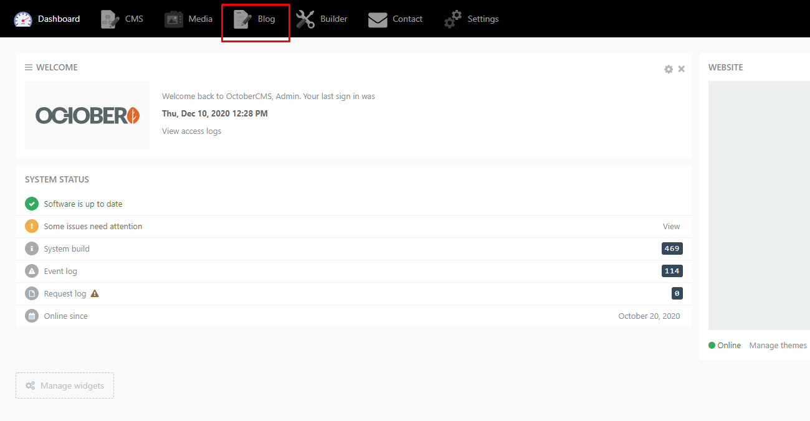

<p align="center">
    
</p>


 ## http://sustainhijau.com

# Table of Contents
1. Login Dashboard
2. Menambahkan Project
4. Menambahkan Blog
6. Mengubah **ID** dan **Password** admin

# 1. Login Dashboard
1. Kunjungi http://sustainhijau.com/backend
2. Masukkan **ID** dan **Password**
```
ID        : admin.shi2020
Password  : password.shi2020
```
<p align="center">
    
</p>

# 2. Menambahkan Project
```
Cara menambahkan Project dan Blog hampir sama, hanya dibedakan melalui jenis Category.
```
1. Pada menu navbar atas pilih **Blog** 
<p align="right">
    
</p>

2. Pilih **+New Post**
3. Kemudian isi kolom sesuai dengan kebutuhan
4. **Penting !!** Jika menginginkan diterbitkan sebagai **Project** maka pada **Category** harus diisikan sebagai **Project** 
<p align="right">
    
</p>

3. **Save**

# 3. Menambahkan Blog
```
Cara menambahkan Project dan Blog hampir sama, hanya dibedakan melalui jenis Category.
```
1. Pada menu navbar atas pilih **Blog** 
<p align="right">
    
</p>

2. Pilih **+New Post**
3. Kemudian isi kolom sesuai dengan kebutuhan
4. **Penting !!** Jika menginginkan diterbitkan sebagai **Blog** maka pada **Category** harus diisikan sebagai **Article** 
<p align="right">
    
</p>

3. **Save**

# 4. Mengubah **ID** dan **Password** admin
1. Pilih logo avatar pada pojok kanan atas halaman dashboard, pilih menu **My Account**
<p align="right">
    
</p>

2. Terdapat kolom **Login** untuk mengubah **ID**, **Password** dan **Confirm Password** untuk menyimpan perubahan maupun mengganti password secara langsung
<p align="right">
    
</p>

3. Pilih **Save**


